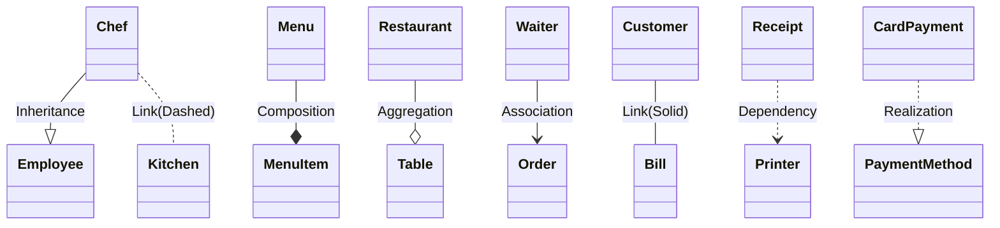

# ApartmentPredictor masterDoc v1

## Summary

### References

- Reference project: [Spring Boot: H2 DB and Thymeleaf – albertprofe wiki](https://albertprofe.dev/springboot/boot-what-create-th-h2.html)
- Microservices: https://spring.io/]
- Spring Boot is open-source: [GitHub - spring-projects/spring-boot: Spring Boot helps you to create Spring-powered, production-grade applications and services with absolute minimum fuss.](https://github.com/spring-projects/spring-boot)
- Spring Boot Guides / Academy: https://spring.io/guides / https://spring.academy/courses
- Quickstart: https://spring.io/quickstart

Historical notes:

- [Spring Framework – albertprofe wiki](https://albertprofe.dev/spring/spring-basics.html)

- [JPA Before Annotatons one-to-many xml](https://github.com/AlbertProfe/ApartmentPredictor/blob/master/docs/appends/JPA_Before_Annotatons:_one-to-many-xml.md)

### Product Goal

> Use this small housing-price dataset to train a regularized regression model that handles multicollinearity, then expose predictions through a Spring Boot REST API and a React form UI where users input area, bedrooms, bathrooms, furnishing, and road proximity for instant price estimates.

We are defining a clear full-stack goal: implement RESTful CRUD endpoints in Spring Boot for Apartment and Post entities, then build React views to list, create, edit, delete, and assign posts to apartments with a simple, responsive UI.

From source:

> A simple yet challenging project, to predict the housing price based on certain factors like house area, bedrooms, furnished, nearness to mainroad, etc.
> 
> The dataset is small yet, it's complexity arises due to the fact that it has strong <mark>multicollinearity</mark>.

### Version goal

> We are defining a CRUD service in Spring Boot for Apartment, Owners, Reviewers and Post entities, then test them to list, create, edit, delete, and assign posts to apartments with <mark>JUnit</mark>.

## Project commits

- [Commits · AlbertProfe/ApartmentPredictor · GitHub](https://github.com/AlbertProfe/ApartmentPredictor/commits/master/)

## Create project

### Using the CLI

> The Spring Boot CLI (Command-Line Interface) can be installed manually by using <mark>SDKMAN</mark>! (the SDK Manager) or by using Homebrew or MacPorts if you are an OSX user. See [Installing the Spring Boot CLI](https://docs.spring.io/spring-boot/installing.html#getting-started.installing.cli) in the “Getting Started” section for comprehensive installation instructions.

- [Installing Spring Boot :: Spring Boot](https://docs.spring.io/spring-boot/installing.html#getting-started.installing.cli)

- [Using the CLI :: Spring Boot](https://docs.spring.io/spring-boot/cli/using-the-cli.html)

By CLI `Spring init`

```textile
[Tue Dec 02 11:09:02] albert@albert-VirtualBox:~
$ spring init --dependencies=web,data-jpa,h2,devtools --build=maven --java-version=21 --name=ApartmentPredictor --artifactId=apartment-predictor --groupId=com.example ApartmentPredictor
```

```text
spring init 
    --dependencies=web,data-jpa,h2,devtools
    --build=maven 
    --java-version=21 
    --name=ApartmentPredictor 
    --artifactId=apartment-predictor 
    --groupId=com.example ApartmentPredictor
```

### Spring Init

- https://start.spring.io/

### Project structure

```textile
[Tue Dec 02 17:12:58] albert@albert-VirtualBox:~/MyProjects/Sandbox/ApartmentPredictorProject/ApartmentPredictor (master)
$ tree 
.
├── HELP.md
├── mvnw
├── mvnw.cmd
├── pom.xml
├── src
│   ├── main
│   │   ├── java
│   │   │   └── com
│   │   │       └── example
│   │   │           └── apartment_predictor
│   │   │               ├── Apartment.java
│   │   │               ├── ApartmentPredictorApplication.java
│   │   │               ├── Owner.java
│   │   │               ├── Post.java
│   │   │               └── Reviewer.java
│   │   └── resources
│   │       ├── application.properties
│   │       ├── static
│   │       └── templates
│   └── test
│       └── java
│           └── com
│               └── example
│                   └── apartment_predictor
│                       └── ApartmentPredictorApplicationTests.java
└── target
    ...

34 directories, 19 files


[Tue Dec 09 11:40:21] albert@albert-VirtualBox:~/MyProjects/Sandbox/ApartmentPredictorProject/ApartmentPredictor/src (master)
$ tree
.
├── main
│   ├── java
│   │   └── com
│   │       └── example
│   │           └── apartment_predictor
│   │               ├── ApartmentPredictorApplication.java
│   │               ├── model
│   │               │   ├── Apartment.java
│   │               │   ├── Owner.java
│   │               │   ├── Reviewer.java
│   │               │   └── Review.java
│   │               ├── repository
│   │               │   ├── ApartmentRepository.java
│   │               │   └── ReviewRepository.java
│   │               └── service
│   │                   ├── ApartmentService.java
│   │                   └── ReviewService.java
│   └── resources
│       ├── application.properties
│       ├── static
│       └── templates
└── test
    └── java
        └── com
            └── example
                └── apartment_predictor
                    └── ApartmentPredictorApplicationTests.java

17 directories, 11 files
```

## Data Model

Data source `csv`

- [Kaggle HousePrices datasheet](https://www.kaggle.com/datasets/yasserh/housing-prices-dataset/data)
- Raw cleanned data:
  - https://raw.githubusercontent.com/ywchiu/riii/master/data/house-prices.csv
  - https://raw.githubusercontent.com/YBI-Foundation/Dataset/main/House%20Prices.csv

### Java classes

```java
// java class
/**
 * The Apartment class models the details of a residential property. 
 * It stores pricing and structural information such as price, area, 
 * number of bedrooms, bathrooms, and floors (stories). It also tracks 
 * property features like main road access, guest room, basement, 
 * hot water, heating, air conditioning, and parking availability. 
 * Additionally, it includes preferences related to furnishing 
 * (furnished, semi-furnished, or unfurnished) and property status. 
 * This class provides getter and setter methods for encapsulated 
 * data access and supports comparison, filtering, and reporting 
 * operations in real estate applications.
 */

public class Apartment {

    private String id;
    private Long price;
    private Integer area;
    private Integer bedrooms;
    private Integer bathrooms;
    private Integer stories;
    private String mainroad;
    private String guestroom;
    private String basement;
    // refactor both fiels to one
    private String hotwaterheating;
    //private String hotwater;
    //private String heating;
    private String airconditioning;
    private Integer parking;
    private String prefarea;
    private String furnishingstatus;
}
```

```java
public class Owner {

    private  String id;
    private String name;
    private String email;
    private int age;
    private boolean isActive;
    private boolean isBusiness;
    private String idLegalOwner;
    private LocalDate registrationDate;
    private int qtyDaysAsOwner;
}
```

```java
public class Review {

    private String id;
    private String title;
    private String content;
    private int rating;
    private LocalDate reviewDate;
}
```

### UML

Here are very brief, concrete `restaurant-related` examples for each **UML** class diagram relationship in [Class diagrams | Mermaid](https://mermaid.js.org/syntax/classDiagram.html):

- **Inheritance (Generalization):**  
  Chef --|> Employee  
  Chef is a type of Employee.
- **Composition:**  
  Menu --* MenuItem  
  Menu is composed of MenuItems; MenuItems can’t exist without the Menu.
- **Aggregation:**  
  Restaurant --o Table  
  Restaurant has Tables, but Tables can exist if the Restaurant is closed.
- **Association:**  
  Waiter --> Order  
  Waiter takes Orders.
- **Link (Solid):**  
  Customer -- Bill  
  Customer is directly connected to Bill, representing a specific interaction.
- **Dependency:**  
  Receipt ..> Printer  
  Receipt depends on Printer (uses it temporarily).
- **Realization:**  
  CardPayment ..|> PaymentMethod  
  CardPayment realizes (implements) PaymentMethod interface.
- **Link (Dashed):**  
  Chef .. Kitchen  
  Chef is loosely connected to Kitchen (less specific/weak association).



#### UML V1.0 ApartmentPredictor

- [UML mermaid](https://github.com/AlbertProfe/ApartmentPredictor/blob/master/docs/appends/ApartmentPredictor-uml_v1.md)


## Code

### MC

> This architecture defines a simple Spring Boot testing setup where a Test component exercises a `Service` layer that delegates to a `Repository`, which in turn <mark>performs CRUD operations against an in-memory/local H2 database. </mark>
> 
> **It is MC (Model-Controller) layered**, with Test invoking Service (buisness logic) → Repository (data access) → DB, enforcing s<mark>eparation of concerns. </mark>
> 
> The goal is to validate application logic and data access without external infrastructure, enabling fast, isolated tests.


### Service

> The [ApartmentService.java](cci:7://file:///home/albert/MyProjects/Sandbox/ApartmentPredictorProject/ApartmentPredictor/src/main/java/com/example/apartment_predictor/service/ApartmentService.java:0:0-0:0) is a Spring service class annotated with `@Service` that provides <mark>business logic for apartment operations</mark>. 
> 
> It contains method stubs for CRUD operations including [findAll()](cci:1://file:///home/albert/MyProjects/Sandbox/ApartmentPredictorProject/ApartmentPredictor/src/main/java/com/example/apartment_predictor/service/ApartmentService.java:10:4-15:5), [createApartment()](cci:1://file:///home/albert/MyProjects/Sandbox/ApartmentPredictorProject/ApartmentPredictor/src/main/java/com/example/apartment_predictor/service/ApartmentService.java:18:4-18:35), [updateApartment()](cci:1://file:///home/albert/MyProjects/Sandbox/ApartmentPredictorProject/ApartmentPredictor/src/main/java/com/example/apartment_predictor/service/ApartmentService.java:20:4-20:36), [deleteApartment()](cci:1://file:///home/albert/MyProjects/Sandbox/ApartmentPredictorProject/ApartmentPredictor/src/main/java/com/example/apartment_predictor/service/ApartmentService.java:22:4-22:36), and [findApartmentById()](cci:1://file:///home/albert/MyProjects/Sandbox/ApartmentPredictorProject/ApartmentPredictor/src/main/java/com/example/apartment_predictor/service/ApartmentService.java:24:4-24:38). 

### Respository

The [ApartmentRepository.java](cci:7://file:///home/albert/MyProjects/Sandbox/ApartmentPredictorProject/ApartmentPredictor/src/main/java/com/example/apartment_predictor/repository/ApartmentRepository.java:0:0-0:0) is a `Spring Data `repository interface that extends `CrudRepository<Apartment, String>`. 

This provides basic `CRUD` (Create, Read, Update, Delete) operations for the `Apartment` entity with a String-type primary key. The interface is empty, relying on Spring Data's automatic implementation to handle standard database operations like `save()`, `findById()`, `findAll()`, and `deleteById()`. 

> The repository serves as the data access layer for apartment-related operations in the apartment predictor application.

### Command Line Runner

> The [ApartmentPredictorApplication](cci:2://file:///home/albert/MyProjects/Sandbox/ApartmentPredictorProject/ApartmentPredictor/src/main/java/com/example/apartment_predictor/ApartmentPredictorApplication.java:9:0-126:1) implements `CommandLineRunner`, which <mark>executes code after the Spring Boot application starts</mark>. 

The **CommandLineRunner** serves as a data initialization mechanism, populating the database with test data upon application startup.

```java
package com.example.apartment_predictor;

import com.example.apartment_predictor.model.Apartment;
import com.example.apartment_predictor.repository.ApartmentRepository;
import org.springframework.beans.factory.annotation.Autowired;
import org.springframework.boot.CommandLineRunner;
import org.springframework.boot.SpringApplication;
import org.springframework.boot.autoconfigure.SpringBootApplication;

@SpringBootApplication
public class ApartmentPredictorApplication implements CommandLineRunner {

    @Autowired
    private ApartmentRepository apartmentRepository;


    public static void main(String[] args) {
        SpringApplication.run(ApartmentPredictorApplication.class, args);
    }

    @Override
    public void run(String... args) throws Exception {
        System.out.println("Creating apartment objects...");

        // Create apartment objects based on your sample data
        Apartment apartment1 = new Apartment(
                13300000L,    // price
                7420,         // area
                4,            // bedrooms
                2,            // bathrooms
                3,            // stories
                "yes",        // mainroad
                "no",         // guestroom
                "no",         // basement
                "no",         // hotwater
                "yes",        // heating
                "yes",        // airconditioning
                2,            // parking
                "yes",        // prefarea
                "furnished"   // furnishingstatus
        );


        // Create additional sample apartments
        Apartment apartment2 = new Apartment(
                8500000L,     // price
                5200,         // area
                3,            // bedrooms
                2,            // bathrooms
                2,            // stories
                "yes",        // mainroad
                "yes",        // guestroom
                "no",         // basement
                "yes",        // hotwater
                "no",         // heating
                "yes",        // airconditioning
                1,            // parking
                "no",         // prefarea
                "semi-furnished" // furnishingstatus
        );

        Apartment apartment3 = new Apartment(
                6200000L,     // price
                3800,         // area
                2,            // bedrooms
                1,            // bathrooms
                1,            // stories
                "no",         // mainroad
                "no",         // guestroom
                "yes",        // basement
                "yes",        // hotwater
                "no",         // heating
                "no",         // airconditioning
                0,            // parking
                "yes",        // prefarea
                "unfurnished" // furnishingstatus
        );

        apartmentRepository.save(apartment1);
        apartmentRepository.save(apartment2);
        apartmentRepository.save(apartment3);

        int index = 0;
        System.out.println("\n=== Apartments in the Database ===");
        for (Apartment apartment : apartmentRepository.findAll()){
            index++;
            System.out.println("#" + index);
             System.out.println(apartment);
        }

        //apartmentRepository.findAll().forEach(System.out::println);
    }


}
```

### Tests JUnit

- [Java SE: JUnit and TDD – albertprofe wiki](https://albertprofe.dev/javase/se-concepts-tdd.html)
- [SpringBoot Scope Management](https://github.com/AlbertProfe/ApartmentPredictor/blob/master/docs/appends/SpringBoot_Scope_Management.md)

## Annotations

- [SpringBoot Annotations](https://github.com/AlbertProfe/ApartmentPredictor/blob/master/docs/appends/SpringBoot-Annotations.md)

## JPA

### Summary

- [Getting Started :: Spring Data JPA](https://docs.spring.io/spring-data/jpa/reference/jpa/getting-started.html)

- [Core concepts :: Spring Data JPA](https://docs.spring.io/spring-data/jpa/reference/repositories/core-concepts.html)

- [Spring Boot: Data &amp; DB – albertprofe wiki](https://albertprofe.dev/springboot/boot-concepts-data.html)

Spring Data’s mission is to provide a familiar and consistent, **Spring-based programming model for data access**.

> It makes it easy to use **data access** technologies, `relational` and `non-relational` databases, `map-reduce frameworks`, and `cloud-based` data services.

This is an **umbrella project which contains many subprojects** that are specific to a given database. The projects are developed by working together with many of the companies and developers that are behind these exciting technologies.

### Relationships

- [JPA Relationships Guide](https://github.com/AlbertProfe/ApartmentPredictor/blob/master/docs/appends/JPA_Relationships_Guide.md)
- [JPA Relationships Implementation Rule](https://github.com/AlbertProfe/ApartmentPredictor/blob/master/docs/appends/JPA_RelationshipsImplementation_Rule.md)

## H2 & application.properties

> Welcome to **H2**, the Java SQL database. The main features of H2 are:
> 
> - Very fast, open source, `JDBC API`
> - Embedded and server modes; in-memory databases
> - Browser based Console application
> - Small footprint: around <mark>2.5 MB jar file size</mark>

References:

- Official web: https://h2database.com/html/installation.html
- Create H2 db from CLI: [Lab#SB08-3: H2 and API Rest – albertprofe wiki](https://albertprofe.dev/springboot/sblab8-3.html#h2-db)
- Step-by-step: [Spring Boot: H2 DB and Thymeleaf – albertprofe wiki](https://albertprofe.dev/springboot/boot-what-create-th-h2.html)
- DDL: [DDL auto generation](https://albertprofe.dev/springboot/sblab8-3.html#configuring-h2-database-in-spring-boot-with-ddl-auto-generation)
- Woking with different profiles: [Profiles and enviroment](https://albertprofe.dev/springboot/sblab8-3.html#working-on-different-environments)  
- [Lab#SB08-3: H2 and API Rest – albertprofe wiki](https://albertprofe.dev/springboot/sblab8-3.html)

Config `applcations properties` 

```properties
spring.application.name=ApartmentPredictor
# config db params connection
spring.datasource.url=jdbc:h2:/home/albert/MyProjects/Sandbox/ApartmentPredictorProject/db/apartmentpredictordb
spring.datasource.driverClassName=org.h2.Driver
spring.datasource.username=albert
spring.datasource.password=1234
# config db param
spring.jpa.database-platform=org.hibernate.dialect.H2Dialect
spring.jpa.show-sql=true
spring.jpa.hibernate.ddl-auto=none
#spring.jpa.hibernate.ddl-auto=create
spring.jpa.hibernate.ddl-auto=update
```

This [application.properties](cci:7://file:///home/albert/MyProjects/Sandbox/rentingCarTest/rentingCar-boot/src/main/resources/application.properties:0:0-0:0) file configures a Spring Boot application for aparment price predictor management with H2 database integration.

Application Identity

- **`spring.application.name=ApartmentPredictor`** - Sets the application name used for identification in logs, monitoring tools, and service discovery. This appears in Spring Boot banners and helps distinguish this app from others.

Database Configuration

- **H2 Database Setup** - Uses H2 as an embedded/file-based database

- **Active URL**: `jdbc:h2:/home/albert/MyProjects/Sandbox/ApartmentPredictorProject/db/apartmentpredictordb` - Points to a persistent file-based H2 database stored locally

- **Commented alternatives**:
  
  - TCP server mode: `jdbc:h2:tcp://localhost/...` (for remote access)
  - In-memory mode: `jdbc:h2:mem:testdb` (data lost on restart)
    Authentication

- **Username**: `albert` (custom user, `sa` is H2's default admin)

- **Password**: `1234` (simple password for development)
  JPA/Hibernate Settings

Database Dialect and DDL

- **`spring.jpa.database-platform=org.hibernate.dialect.H2Dialect`** - Tells Hibernate to use H2-specific SQL syntax
- **`spring.jpa.show-sql=true`** - Enables SQL query logging for debugging
- **`spring.jpa.hibernate.ddl-auto=update`** - Automatically updates database schema without dropping existing data (safer than `create` which recreates tables)

### DDL - Data Definition Language

> **DDL - Data Definition Language**
> 
> <mark>DDL (Data Definition Language)</mark> consists of SQL commands that can be used for defining, altering and deleting database structures such as tables, indexes and schemas. It simply deals with descriptions of the database schema and is used to create and modify the structure of database objects in the database


### Populate DB

- [ImportCSVtoH2](https://github.com/AlbertProfe/ApartmentPredictor/blob/master/docs/appends/ImportCSVtoH2.md)

## Maven

> **Apache Maven** is a <mark>build tool for Java projects</mark>. Using a <mark>project object model </mark>(`POM`), Maven manages a project's compilation, testing, and documentation.

- [Maven](https://maven.apache.org/)

- [Maven Repository](https://mvnrepository.com/)

### pom.xml

```xml
<?xml version="1.0" encoding="UTF-8"?>
<project xmlns="http://maven.apache.org/POM/4.0.0" xmlns:xsi="http://www.w3.org/2001/XMLSchema-instance"
    xsi:schemaLocation="http://maven.apache.org/POM/4.0.0 https://maven.apache.org/xsd/maven-4.0.0.xsd">
    <modelVersion>4.0.0</modelVersion>
    <parent>
        <groupId>org.springframework.boot</groupId>
        <artifactId>spring-boot-starter-parent</artifactId>
        <version>3.2.0</version>
        <relativePath/> <!-- lookup parent from repository -->
    </parent>
    <groupId>com.example</groupId>
    <artifactId>apartment-predictor</artifactId>
    <version>0.0.1-SNAPSHOT</version>
    <name>ApartmentPredictor</name>
    <description>Demo project for Spring Boot</description>
    <url/>
    <licenses>
        <license/>
    </licenses>
    <developers>
        <developer/>
    </developers>
    <scm>
        <connection/>
        <developerConnection/>
        <tag/>
        <url/>
    </scm>
    <properties>
        <java.version>21</java.version>
    </properties>
    <dependencies>
        <dependency>
            <groupId>org.springframework.boot</groupId>
            <artifactId>spring-boot-starter-data-jpa</artifactId>
        </dependency>
        <dependency>
            <groupId>org.springframework.boot</groupId>
            <artifactId>spring-boot-starter-web</artifactId>
        </dependency>

        <dependency>
            <groupId>org.deeplearning4j</groupId>
            <artifactId>deeplearning4j-core</artifactId>
            <version>1.0.0-M2.1</version>
        </dependency>
        <dependency>
            <groupId>org.nd4j</groupId>
            <artifactId>nd4j-native-platform</artifactId>
            <version>1.0.0-M2.1</version>
        </dependency>

        <dependency>
            <groupId>org.springframework.boot</groupId>
            <artifactId>spring-boot-devtools</artifactId>
            <scope>runtime</scope>
            <optional>true</optional>
        </dependency>
        <dependency>
            <groupId>com.h2database</groupId>
            <artifactId>h2</artifactId>
            <scope>runtime</scope>
        </dependency>
        <dependency>
            <groupId>org.springframework.boot</groupId>
            <artifactId>spring-boot-starter-test</artifactId>
            <scope>test</scope>
        </dependency>
    </dependencies>

    <build>
        <plugins>
            <plugin>
                <groupId>org.springframework.boot</groupId>
                <artifactId>spring-boot-maven-plugin</artifactId>
            </plugin>
        </plugins>
    </build>

</project>
```

## Tech Stack

- IDE: IntelliJ IDEA 2025.1.3 (Community Edition)
  
  - [Descargar IntelliJ IDEA](https://www.jetbrains.com/es-es/idea/download/?section=linux)
  
  - With [Installing snap on Ubuntu | Snapcraft documentation](https://snapcraft.io/docs/installing-snap-on-ubuntu): `sudo snap install intellij-idea-community --classic`

- Java 21 (or 25, 17, 11, 8) <mark>open-jdk</mark>

- <mark>JUniit 3.8.1</mark>

- Create project by <mark>Sprint Init</mark>
  
  - Alternative: Maven Project: **`maven-archetype-quickstart` archetype**
    
    - https://maven.apache.org/
    
    - mvn --version
      Apache Maven 3.8.7
      Maven home: /usr/share/maven
      Java version: 21.0.8, vendor: Ubuntu, runtime: /usr/lib/jvm/java-21-openjdk-amd64
      Default locale: en_US, platform encoding: UTF-8
      OS name: "linux", version: "6.8.0-83-generic", arch: "amd64", family: "unix"

- <mark>Spring Data JPA 4.0.0</mark>
