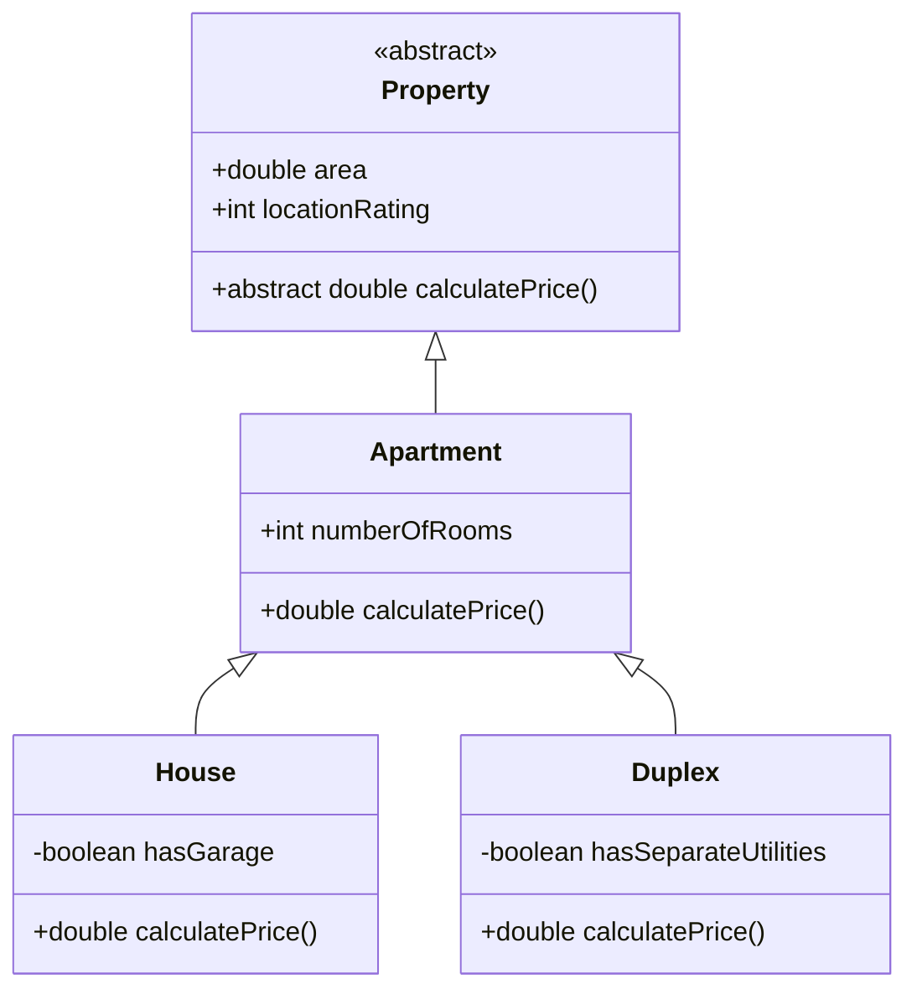
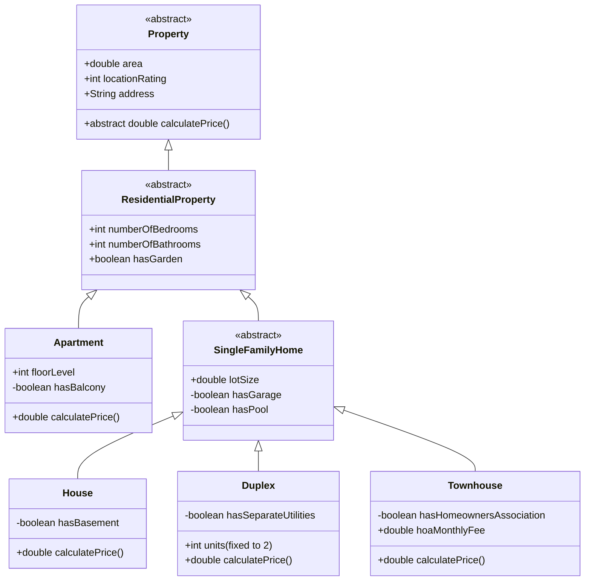

# Lab#01: Java SE Inheritance

[Project Repository](https://github.com/AlbertProfe/ApartmentPredictor/tree/master)

## Summary

> This laboratory introduces fundamental concepts of **inheritance** in Java SE through<mark> a real estate domain model.</mark> 
> 
> Students will build a class hierarchy starting with an abstract `Property` class, extending it to a concrete `Apartment` class, and further specializing into `House` and `Duplex` subclasses. 
> 
> The exercise emphasizes method overriding, polymorphism, multi-level inheritance, and the use of type-specific fields to customize behavior (particularly in the `calculatePrice()` method).

## Reference



Base implementation provided as starting point:

```java
public abstract class Property {
    protected double area;
    protected int locationRating;

    public abstract double calculatePrice();
}
```

```java
public class Apartment extends Property {
    protected int numberOfRooms;

    @Override
    public double calculatePrice() {
        double basePrice = area * 120 + (numberOfRooms * 8000);
        return basePrice * (1 + (locationRating * 0.04));
    }
}
```

```java
public class House extends Apartment {
    private boolean hasGarage;

    @Override
    public double calculatePrice() {
        double basePrice = area * 180 + (numberOfRooms * 15000);
        if (hasGarage) {
            basePrice += 25000;
        }
        return basePrice * (1 + (locationRating * 0.06));
    }
}
```

```java
public class Duplex extends Apartment {
    private boolean hasSeparateUtilities;

    @Override
    public double calculatePrice() {
        double basePrice = area * 220 + (numberOfRooms * 12000);
        if (hasSeparateUtilities) {
            basePrice *= 1.15;
        }
        return basePrice * (1 + (locationRating * 0.09));
    }
}
```

## Objective

- Understand and apply single and multi-level inheritance.
- Practice method overriding and polymorphic behavior.
- Use inherited and subclass-specific fields effectively.
- Demonstrate clean object-oriented design in a realistic domain.
- Apply <mark>unit testing with JUnit</mark> to verify object creation and method behavior across the inheritance hierarchy.

## Tasks

Students must **fork** the repository, create a personal branch, implement one of the following variants, and submit a **Pull Request**.

To further reinforce concepts of inheritance, method overriding, and polymorphism, add the following methods to the hierarchy. Each method can be declared in a suitable superclass (often abstract) and overridden in subclasses to provide type-specific behavior.

#### 1. `abstract String getPropertyType()`

**Purpose:** Returns a human-readable type name (e.g., "Apartment", "House").  
**Placement:** Declare as abstract in `Property`.  
**Overrides:**  

- `Apartment`: returns "Apartment"  
- `House`: returns "Single-Family House"  
- `Duplex`: returns "Duplex (2 Units)"  
- `Townhouse`: returns "Townhouse"  
  **Benefit:** Simple polymorphism demo — calling on a `Property` reference shows the actual type.

#### 2. `double calculateAnnualPropertyTax()`

**Purpose:** Estimates yearly property tax based on calculated price and location.  
**Placement:** Declare in `Property` with a default implementation (e.g., price × base tax rate × location factor).  
**Overrides:**  

- `ResidentialProperty` or specific subclasses: adjust tax rate (e.g., townhouses pay extra due to HOA, apartments lower due to shared maintenance).  
  **Benefit:** Shows how subclasses can refine a common formula.

#### 3. `boolean isSuitableForFamily(int familySize)`

**Purpose:** Determines if the property is suitable for a family of given size.  
**Placement:** Declare in `ResidentialProperty` with default logic (based on bedrooms/bathrooms).  
**Overrides:**  

- `Apartment`: stricter (e.g., needs at least 1 bathroom per 3 people).  
- `House` / `Townhouse`: more lenient + bonus if hasGarden or hasPool.  
- `Duplex`: suitable only for larger/extended families.  
  **Benefit:** Uses multiple fields, including subclass-specific ones.

#### 4. `double calculateRenovationCost()`

**Purpose:** Estimates cost to modernize the property.  
**Placement:** Declare in `ResidentialProperty`.  
**Overrides:**  

- `Apartment`: lower cost (focus on interior + balcony if present).  
- `House`: higher (includes garage, pool, basement).  
- `Townhouse`: medium + extra if HOA restricts changes.  
  **Benefit:** Demonstrates using both inherited and specific fields meaningfully.

#### 5. `String listKeyFeatures()`

**Purpose:** Returns a formatted string listing notable features.  
**Placement:** Declare in `Property` with basic implementation (area, location, address).  
**Overrides:**  

- Each concrete class appends its own features (e.g., House adds "Garage: Yes", "Pool: Yes", "Basement: Yes").  
  **Benefit:** Shows progressive overriding — each level adds more detail.

#### 6. `double estimateRentalIncomePerMonth()`

**Purpose:** Estimates potential monthly rental income.  
**Placement:** Declare in `ResidentialProperty` returning 0 by default (owner-occupied assumption).  
**Overrides:**  

- `Apartment`: moderate amount based on bedrooms and floorLevel.  
- `Duplex`: high (double the single-unit rate + bonus if separate utilities).  
- `Townhouse`: similar to apartment but slightly higher.  
- `House`: optional override if marketed as rental.  
  **Benefit:** Strong example of selective overriding — not all properties generate rental income easily.

#### 7. `boolean requiresHomeownersAssociation()`

**Placement:** Declare in `SingleFamilyHome` returning false.  
**Overrides:**  

- `Townhouse`: returns true.  
  **Benefit:** Shows method relevant only to a branch of the hierarchy.

**Recommended Implementation Strategy:**

- Start by adding abstract/default methods in the highest appropriate class.
- Override in concrete classes (and intermediate abstracts if needed) using `super` calls where sensible to reuse logic.
- Create a test class that:
  - Instantiates various properties.
  - Stores them in a `List<Property>` or `List<ResidentialProperty>`.
  - Loops and calls several of these methods polymorphically.
  - Prints results to clearly show different behaviors for the same method call.

## UML enhaced

**Objective:** Build a more sophisticated inheritance hierarchy for real estate properties, introducing greater complexity through additional abstraction, more specialized subclasses, new fields at different levels, and richer price calculation logic. This exercise reinforces multi-level inheritance, method overriding, polymorphism, and realistic domain modeling.

**New Class Hierarchy (Mermaid UML):**



**Key Improvements and Added Complexity:**

- **Property** (top-level abstract): now includes String address for more realism.
- **ResidentialProperty** (new intermediate abstract class): groups common residential features (numberOfBedrooms, numberOfBathrooms, hasGarden) shared by apartments and single-family homes.
- **Apartment**: now has floorLevel and private hasBalcony — higher floors and balconies add value.
- **SingleFamilyHome** (new abstract subclass): introduces lotSize, hasGarage, and hasPool — features typical of standalone homes.
- Three concrete subclasses under SingleFamilyHome:
  - **House**: traditional single-family with optional hasBasement.
  - **Duplex**: fixed 2 units, uses hasSeparateUtilities.
  - **Townhouse** (new): attached home with hasHomeownersAssociation and hoaMonthlyFee (which reduces net value).

**Suggested calculatePrice() Logic Ideas:**

- Base price always factors in area, locationRating, numberOfBedrooms, and numberOfBathrooms.
- **Apartment**: higher floor levels increase price; balcony adds premium.
- **House**: large lot, garage, pool, basement, and garden significantly boost value.
- **Duplex**: rental income potential — higher base per sqft + bonus if separate utilities.
- **Townhouse**: similar to house but reduced by HOA fees (e.g., subtract annualized fee from value).

## Deliverables

1. **Fork** the repository: https://github.com/AlbertProfe/ApartmentPredictor
2. **Clone** your forked repository locally.
3. Create a new **branch** named `lab01-yourGitHubUsername`.
4. Implement **exactly one** of the 7 task variants (clearly indicate which variant in the commit message and PR description).
5. Commit and push your changes.
6. Open a **Pull Request** from your branch to the original `master` branch.
7. In the PR description, include:
   - Variant number and title
   - Brief explanation of changes
   - Screenshot or output of the program execution

Good luck!
